# GLOBAL TERRORISM ANALYSIS 
The Global Database is an open-source dataset that documents terrorist incidents worldwide, recorded as a log of attacks. It has been in operation since 1970, providing information on attack methods, locations, and casualties, and the terrorist organizations themselves.
I downloaded the dataset from the [National Consortium for the Study of Terrorism and Responses to Terrorism](https://www.start.umd.edu/gtd-download). Alternatively, you could download the dataset from [Kaggle](https://www.kaggle.com/datasets/START-UMD/gtd?resource=download)

## GOAL OF THE ANALYSIS 
### Questions to answer 
1.	Is the nature of terrorist attacks coordinated or spontaneous?
2.	The state and possible future of their medium of destruction
3.	How destructive and disruptive are terrorist attacks actually are?
4.	How do we rescue more hostages?

### Hypotheses
1.	Terrorist attacks are coordinated
2.	Terrorists often get their hands on deadly state-of-the-art weaponry
3.	Terrorist attacks are very destructive, leaving heavy casualties
4.	Once captured, the terrorists have the upper hand, so we may have to honor their demand

## DATA CLEANING
I decided to drop columns that are either irrelavant to the scope of the analysis or contain overly specific details: 
-	latitude
-	longtitude
-	INT_LOG
-	INT_IDEO
-	INT_MISC
-	INT_ANY
-	location
-	addnotes
-	dbsource
-	summary
-	provstate
-	alternative_txt
-	attacktype3
-	attacktype3_txt
-	ransomnote
I also changed some columns’ label for better readability.

### Overview of important fields:
-	**extended**: indicating whether the incident happened in more than 24 hours
-	**crit1**: terrorism for political/social/economic purposes
-	**crit2**: terrorism for intimidation/coercion purposes
-	**crit3**: terrorism aimed at civilians
-	**multiple**: indicating whether the attack is part of a series of related/planned attacks
-	**success**: indicating whether the attack was successful
-	**ishostkid**: indicating whether the terrorists capture hostages
-	**nhostkid**: number of hostages taken
-	**kidhijcountry**: name of the country where the terrorists captured the hostages
-	**ransom**: indicating whether ransom was demanded
-	**hostkidoutcome**: the outcome of hostages
-	**related**: ID of related attacks (only applicable if multiple == 1)

## DATA ANALYSIS
Firstly, let’s see the general trend of terrorism:
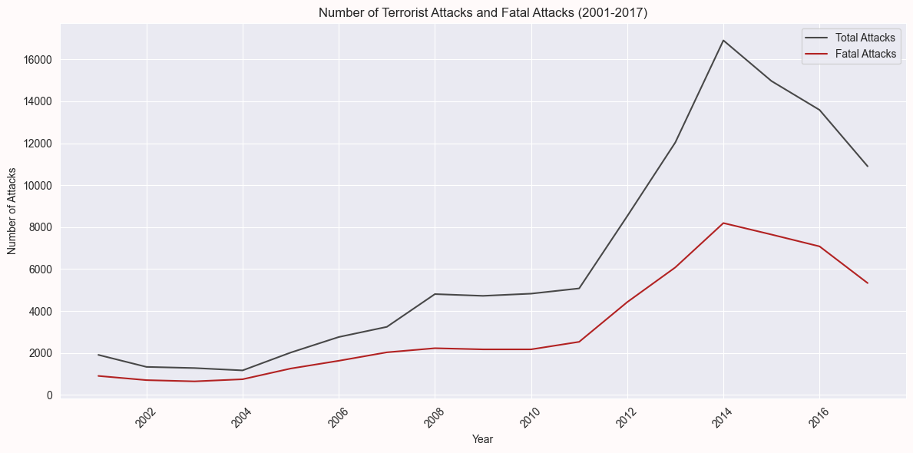
We can see:
-	Slight increase in the number of attacks during 2007 – 2008
-	The lines skyrocketed in the 2011 – 2014 period
However, it is important to hightlight that the rise in fatal attacks – those resulting in at least one death—has not increased at the same rate as the overall number of attacks. 
The casualty statistics is *surprising*:
-	**Fatalities averaging 2.4 per attack, with mode = 0**
-	**Wounded averaging 3.1 per attack, with mode = 0**
-	
To emphasize the point, here is a visualization showing how attacks with few fatalities are overwhelmingly dominant:

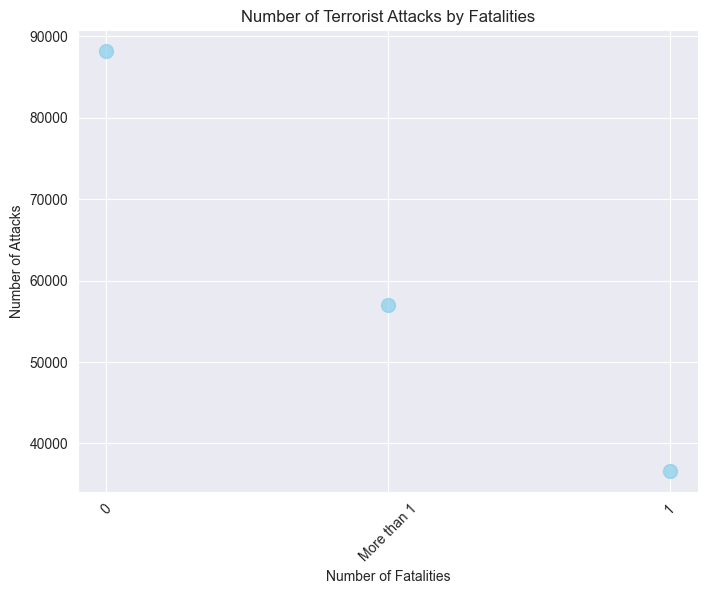

--> Countrary to popular belief, terrorist attacks often leave very few casualty

The coordinated, high-casualty terrorist attacks of 9/11 are a perfect example of a black swan event – defined by essayist Nassim Nicholas Taleb as one that falls outside the realm of regular expectations, has a high impact, and defies predictions. 
It seems the fear they evoke often stems from public perception – seen as dangerous, strategic, and leaving numerous casualties in their wake. But how accurate is this view? And will their fatality rate remain the same in the future? 

### TERRORISM IS REACTIONARY BY NATURE
Most of the attacks are **quick sweeps**, ending in less than 24 hours:
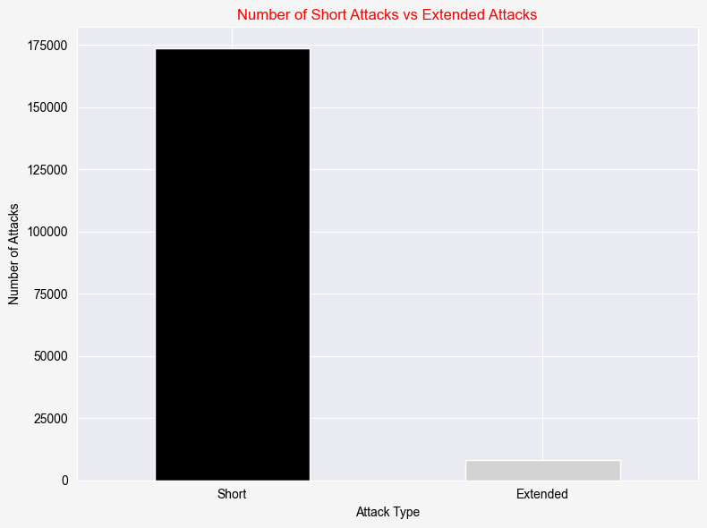

Terrorists often attack with low coordinance, as demonstrated by the number of coordinated attacks compared to uncoordinated ones:
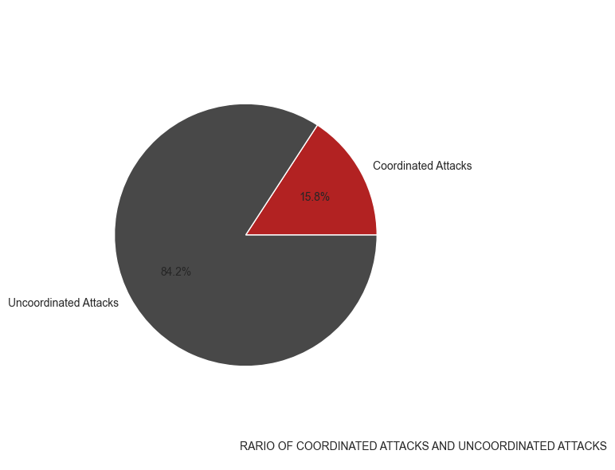

The above chart is not perfect, since the database only adopted the columns “multiple” and “related” after 1997. I opted to only include attacks where we can be certain whether it was coordinated.
What about their weapons of choice?
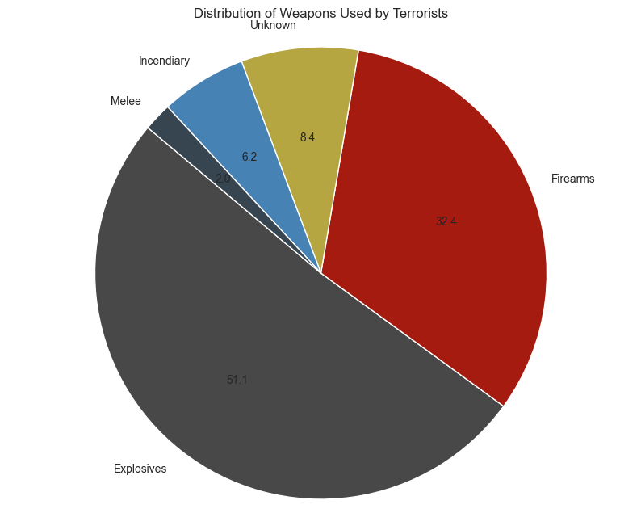

Terrorists tend to use conventional weapons, such as explosives, at 51.1%, and firearms, at 32.4%. Interestingly, highly dangerous weapons such as biological/chemical/radiological/nuclear don’t even show up in the top 5 most used types. 
“Explosives” is too broad of a category to get a good grasp of the picture. We need to dig deeper into the weapon subtype field:
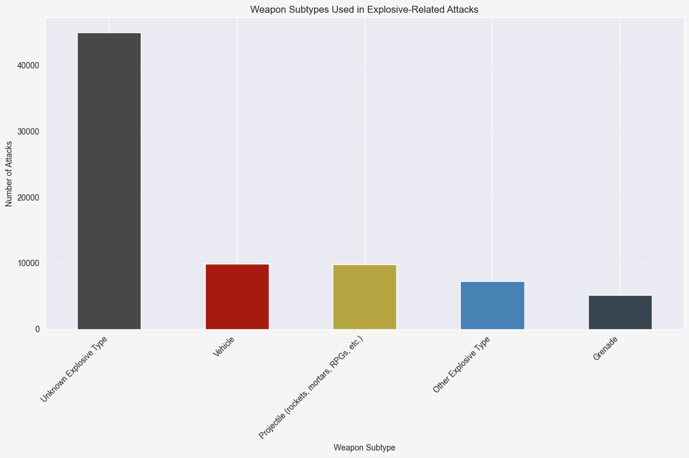

The most popular explosive types are:
-	Vehicle
-	Projectile
-	Other explosive type
-	Grenade

It’s unfortunate (and understandably so) that most of the time we can’t know for sure the type of explosive used.
Time to take a look at their firearms:
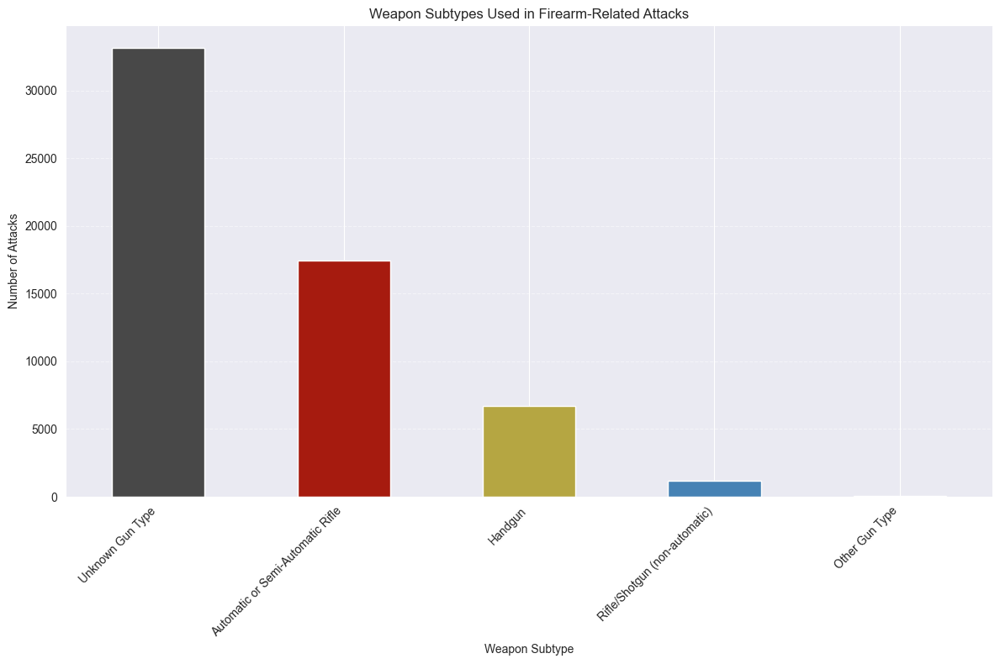

The most popular firearm types are:
-	Automatic/Semi-automatic rifle
-	Handgun
-	Rifle/shotgun
So far, nothing shocking about their weapons. But are they interested in revolutionizing their lethal instruments? To answer that question, let’s observe the types of weapons used over the years:

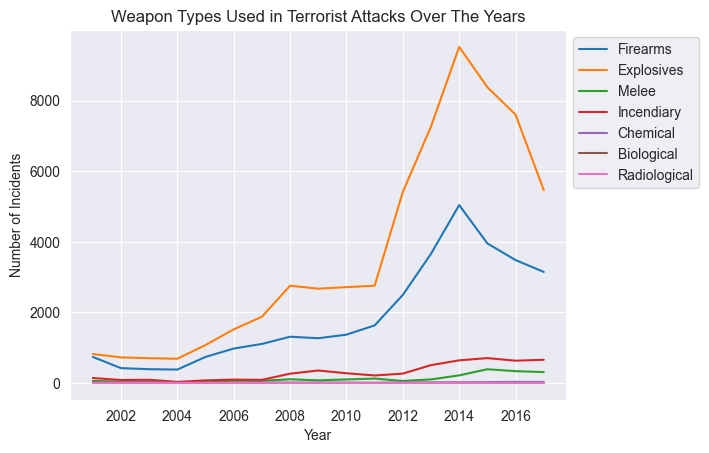

Usage of biological weapons, chemical weapons and radiological weapons do not fluctuate over the years. It’s safe to assume terrorists either have no interests in them or have no resource to do so.

### WAYS TO MITIGATE AFTERMATH 
Another point of interest in the topic of terrorism is how to mitigate the aftermath, and the Global Terrorism Database provides excellent data for us to get insights about hostage situations.
First of all, how common is civilians getting taken as hostage?
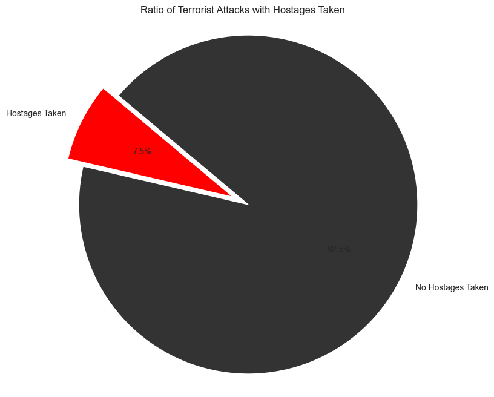

A considerable amount of time, which equates to 7.5% of all terrorist attacks.
Unfortunately, 57.4% of hostages are executed, as seen in the pie chart:

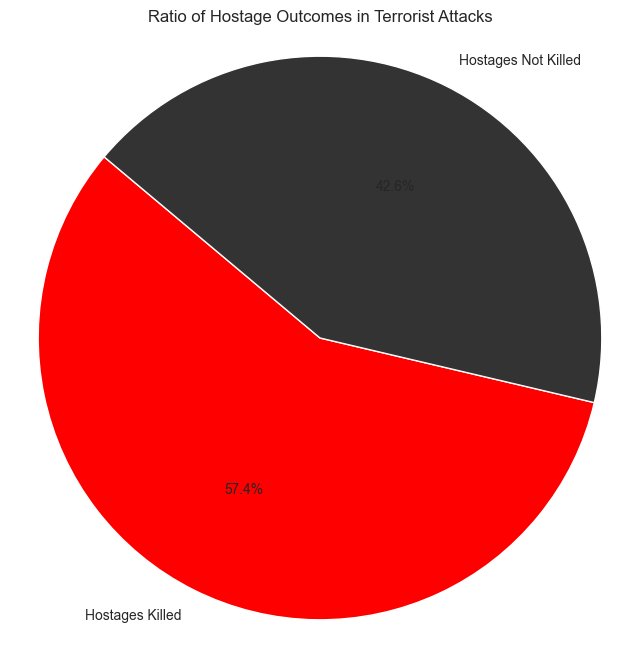

We are able to rescue them only 14.1% of the time:
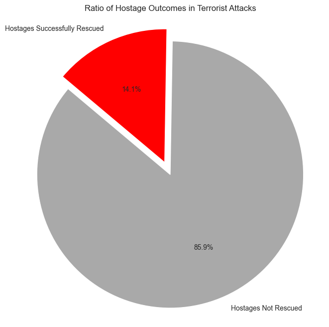

All data points to this being an area for improvement.
I explored in a few directions to zero in on the solutions: The **types of attack most commonly associated with hostage taking/kidnapping**, their **preferred mode of navigation** after taking hostages, and lastly, the **effectiveness of negotiating with terrorists.**
As we can see, Hijacking events have the highest chance of hostages being involved, while Barricade incidents result in the most deaths:

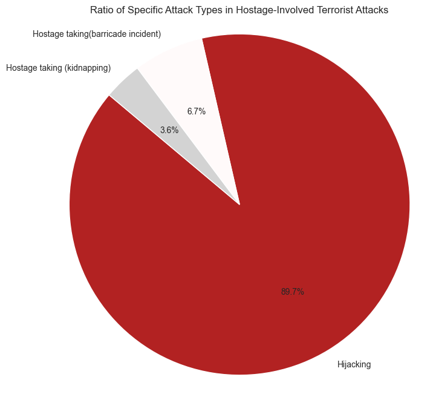

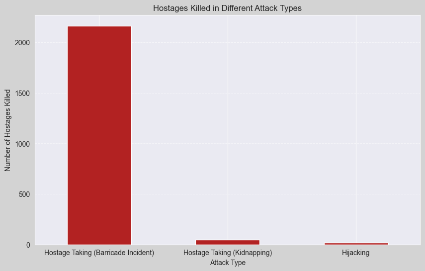

We should look into how to best prevent hijacking/kidnapping and barricade incidents from happening.
Perhaps insights into their preferred mode of navigation might help?

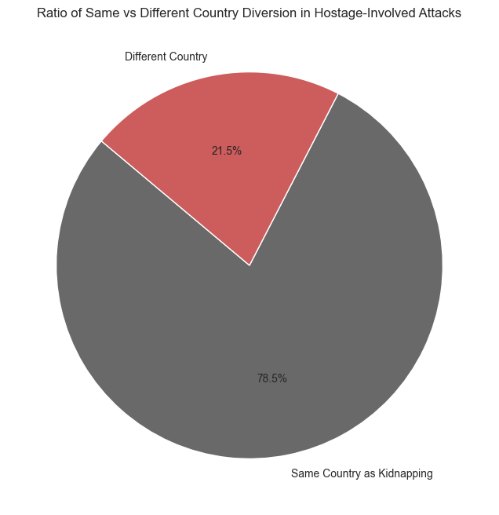

Most of the time they remain in the same country, but 21.5% is not at all an insignificant portion. Assuming when they flee to another country is when the most resource is needed, **it’s best we devise a strategy for clear, responsive coordination between countries in such cases.**
We happen to know that Barricade attacks result in the most deaths. Did we make the best decision possible when lives were on the line, regarding ransom payment?

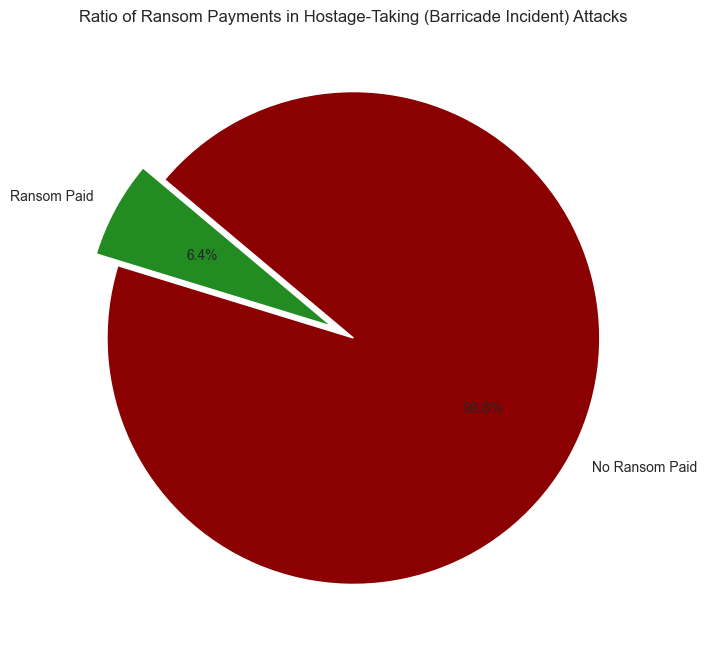

We only paid ransom 6.4% of the time – surprisingly low, yet understandable due to the volatility of terrorist operations.

## FINDINGS AND INSIGHTS 
|Questions | Hypothesis | Verdict |
|:----------|:------------|:---------:|
|Is the nature of terrorist attacks coordinated or spontaneous?|Terrorist attacks are coordinated|Mostly false|
|The state and possible future of their medium of destruction?|Terrorists often get their hands on deadly state-of-the-art weaponry|False|
|How destructive and disruptive are terrorist attacks actually are?|Terrorist attacks are very destructive, leaving heavy casualties|False|
|How do we rescue more hostages?|Once captured, the terrorists have the upper hand, so we may have to honor their demand|Inconclusive|

Finally, to conclude our analysis with proposed solutions:

|Insights|Proposed solutions|
|:--------|:------------------|
|Terrorist groups are unlikely to deploy weapons capable of causing mass casualties|Tighten the regulation of improvised and rudimentary weapons|
|Given the inherently isolated and spontaneous nature of terrorism, only well-established groups with external funding can utilize advanced weaponry|- Strengthen international cooperation to establish transparent measures for military expenditures, preventing the support of terrorist activites 
- Monitor the movements of groups with repeated attack history|
|86% of hostages not rescued, mostly in barricade situations|- Improve aviation security
- Organize hostage rescue drills in high-security buildings, develop equiment to support such operations
- Revise negotiation policies in hostage-related situations|
|79% of terrorist organizations, despite moving, remain within the borders of the original country|Strengthen communication networks between relevant government organizations within a country and across nations in cases of emergency|

## LIMITATIONS OF THE ANALYSIS
It’s important for me to identify and acknowledge the limitations of my study. 
Due to the sensitive topic of the dataset, as someone who loves data and has an interest in the topic despite having no formal education on international affairs or policies, I avoided taking leaps in logic that might not withstand expert scrutiny.

## REFERENCES 
-	The Global Terrorism Database dataset: https://www.start.umd.edu/gtd-download

